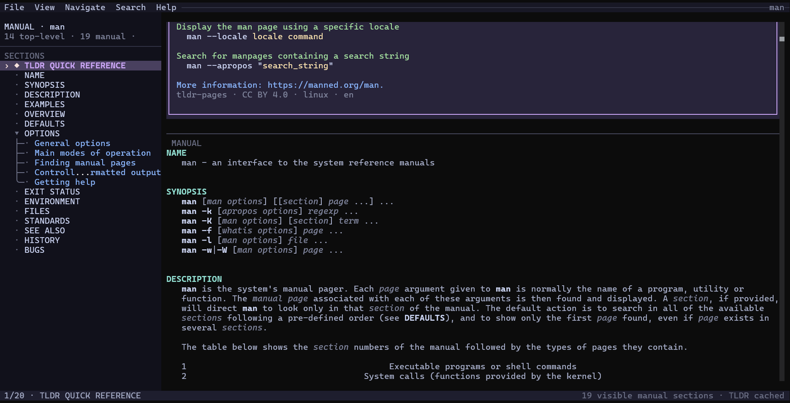

# ManT

[](https://github.com/BryanHeBY/ManT/actions/workflows/ci.yml)
[](https://codecov.io/gh/BryanHeBY/ManT)
[](LICENSE)

ManT makes local Unix manual pages easier to explore for people and easier to
query for software. It also accepts local Markdown, lowering both sources into
one structured document model. Read the complete document in a **responsive
terminal UI**, or query it through the **`mant` CLI and MCP server for agents
and scripts**.



## Two tools, one document model

| Tool | Best for | Highlights |
| --- | --- | --- |
| `mantui` | Reading in a terminal | Complete manuals and Markdown, hierarchy-aware sidebar, in-page links, search, and tldr quick references |
| `mant` | Agents and automation | Markdown, text, JSON, generated schemas, semantic option lookups, location-aware search, and MCP stdio |

Both tools parse local `man` and `mdoc` sources with bundled libmandoc and
support a deliberately structured Markdown subset. A system `mandoc`
installation is not required. If an installed `tldr` client has data for a
manual topic, ManT puts that quick reference before the manual.

## Install

### Linux release archive

Download the archive for your architecture from the
[latest release](https://github.com/BryanHeBY/ManT/releases/latest), extract
it, and put both executables on `PATH`:

```sh
tar -xzf mant-<version>-linux-<arch>.tar.gz
cd mant-<version>-linux-<arch>
install -Dm755 mantui mant -t ~/.local/bin
```

`mantui` locates its companion CLI through `MANT_PATH` first and then
`PATH`, so keep `mantui` and `mant` together when installing from an archive.
The release archive includes `mant.md` and `mantui.md` for immediate
self-hosted browsing, plus the relevant bundled-parser license. A SHA-256
checksum is published alongside it.

### Build from source

Source builds support Linux and macOS. They require local manual pages and the
`man` command, plus Bun, Rust 1.88+, and a C compiler (GCC on Linux or Clang on
macOS by default).

```sh
bun install
bun run build
PATH="$PWD/dist:$PATH" mantui git
```

The build produces `dist/mantui` and `dist/mant`. For a fast development
loop, use `bun run dev -- git`; it builds and selects the local `mant` binary
automatically.

## Read manuals interactively

```sh
mantui git
mantui printf --section 3
mantui tar
mantui README.md
```

The UI always shows the complete document. Its sidebar mirrors nested
sections, can reveal normalized command-line options on demand, follows
page-local references, and synchronizes with the reading position after
scrolling settles. An embedded `TLDR Quick Reference` Markdown heading keeps
the quick-reference presentation without creating a separate side document.
Use `mantui -h` for the focused interactive command reference.

## Query manuals from agents and scripts

Direct content queries default to Markdown:

```sh
mant git
mant README.md
cat guide.md | mant -
mant printf --section 3 --format text
mant git --format json --compact
```

Discover a document before retrieving only the content you need. Heading paths
are one-based; `0` is reserved for an available external tldr quick reference,
while Markdown content before the first heading is addressable as `root`.

```sh
mant gcc --outline
mant gcc --outline sections
mant tar --node acls --format markdown
mant README.md --node root
mant gcc --node 4.2 --node 4.7 --format json
```

Ask directly about one semantic entry without first walking the outline:

```sh
mant tar --explain=--exclude
mant tar --explain exclude
```

Use the `=` form when the selector starts with `-`. `--explain` returns one
option, command, or environment-variable entry; use `--node` for a whole
section or tldr content.

Search returns matches with stable Markdown line and column coordinates, plus
the nearest reusable outline path:

```sh
mant tar --search=--acls --context 1
mant gcc --search 'worktree|branch' --regex --case smart
```

For machine integration, the versioned JSON Schema is discoverable from the
binary rather than copied from documentation:

```sh
mant --schema request
mant --schema all --compact
mant -h
```

Run `mant --update-tldr` to refresh data through the installed client when
available, otherwise through ManT's private cache.

## Connect agents over MCP

Run the same native executable as a read-only MCP server over standard input
and output:

```sh
mant --mcp
```

Configure an MCP client with command `mant` and arguments `["--mcp"]`.
`tools/list` exposes generated input and output JSON Schemas for four tools:
`mant_document_outline`, `mant_document_get`, `mant_document_explain`, and
`mant_document_search`. Their shared `target` accepts either a manual topic or
a local Markdown path, and they return the same versioned ManT projections as the
direct CLI. The server has no network transport and no mutation tools; its
standard output is reserved for MCP JSON-RPC, while diagnostics use standard
error.

## Architecture

```text
mantui (Bun / OpenTUI React)
  └─ versioned JSON over stdio → mant
                                  └─ mant-core
                                       ├─ mant-ast
                                       └─ libmandoc-rs
                                            └─ vendored libmandoc + private C shim

MCP client ── stdio JSON-RPC → mant --mcp ──→ mant-core
```

Rust owns source discovery, parsing, the stable AST, tldr integration, and
Markdown/text/JSON output. `libmandoc-rs` exposes an owned, renderer-neutral
parse tree; `mant-core` lowers that tree into ManT's document contract.
TypeScript owns only terminal interaction and presentation after validating the
native response boundary.

## Documentation

- [mant self manual](docs/manuals/mant.md)
- [mantui self manual](docs/manuals/mantui.md)
- [Native architecture and protocol](docs/architecture/native-core.md)
- [Development guide and repository map](docs/development.md)
- [Maintainer release procedure](docs/releasing.md)

## License

ManT is licensed under the [Apache License 2.0](LICENSE). The bundled mandoc
source retains its upstream license.
