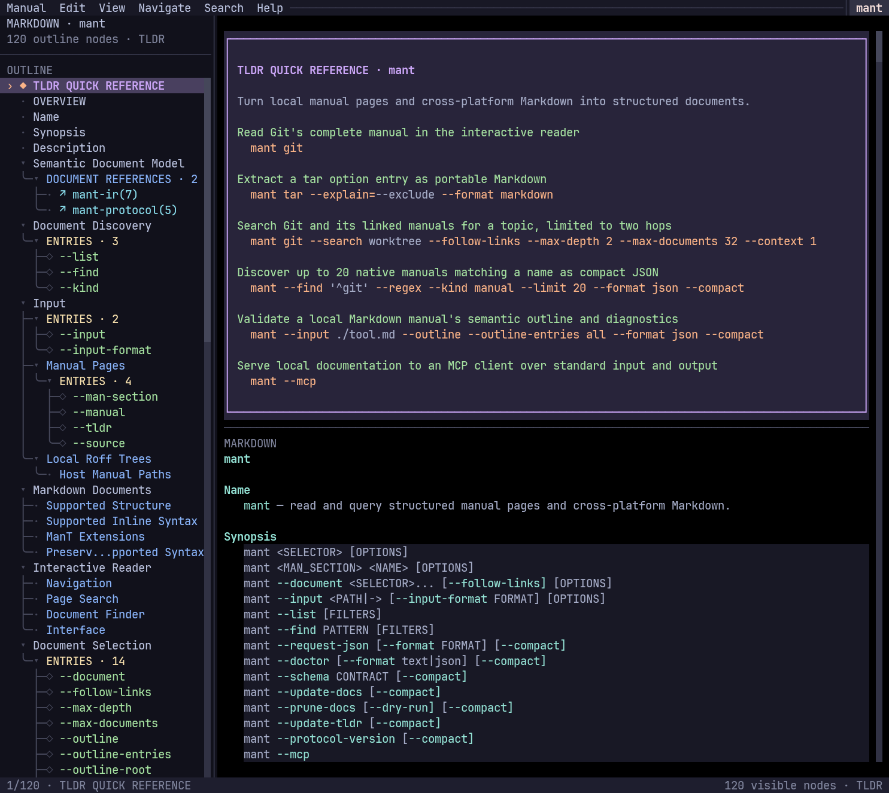

# ManT

[](https://github.com/BryanHeBY/ManT/actions/workflows/ci.yml)
[](https://codecov.io/gh/BryanHeBY/ManT)
[](https://crates.io/crates/mant)
[](LICENSE)

ManT turns dense local manuals and structurally compatible Markdown into
navigable documents for people and precise, reusable knowledge for agents.
Linux with glibc, macOS, and Windows use the same bundled parser and normalized
model; Windows can index user-collected roff pages without requiring a Unix
runtime.
One native `mant` executable provides the full-screen reader, deterministic
Markdown/text/JSON output, generated schemas, and a read-only MCP server.



## Install

Install or update the latest release.

**Unix (Linux with glibc, or macOS)**

```sh
curl --proto '=https' --tlsv1.2 -LsSf https://raw.githubusercontent.com/BryanHeBY/ManT/main/scripts/install.sh | sh
```

**Windows (PowerShell)**

```powershell
irm https://raw.githubusercontent.com/BryanHeBY/ManT/main/scripts/install.ps1 | iex
```

All options, uninstallation, and alternative methods are in the
[installation guide](docs/installation.md).

**Agent prompt**

```text
Read https://raw.githubusercontent.com/BryanHeBY/ManT/main/docs/installation.md
and install or update the latest ManT release for this system. Use its
recommended user-scoped method, verify the installation, and report any PATH
change still needed.
```

## One command, two workflows

| Workflow | Selection | Highlights |
| --- | --- | --- |
| Interactive reading | `mant NAME` in a terminal, or `--ui` | Complete document, hierarchy-aware sidebar, scroll following, page-local links, search, mouse input, and tldr quick references |
| Structured queries | Projection options, `--format`, redirection, or `--mcp` | Outlines, excerpts, semantic option explanations, location-aware search, Markdown/text/JSON, generated schemas, and MCP stdio |

A complete query automatically opens the reader only when both standard input
and output are terminals. Redirection remains useful and predictable:

```sh
mant git > git.md
mant git | less
```

Use `--ui` to require the reader or `--format markdown` to require output,
independent of terminal detection.

## Why ManT

- **Structure instead of a flat pager.** Sections, subsections, options, and
  page-local references remain navigable.
- **One interpretation path.** The reader, output renderers, search, schemas,
  and MCP tools consume the same normalized Rust document model.
- **Options are semantic nodes.** Retrieve `--exclude` directly instead of
  searching an entire page.
- **Search results are reusable.** Matches include stable outline nodes and
  generated-Markdown line and column coordinates.
- **Local-first and self-contained.** Builds bundle their primary libmandoc
  parser; ordinary use needs no network service or system `man`/`mandoc`
  executable on any supported platform.
- **Markdown uses the same model.** Project documentation gains the same
  outline, excerpt, search, TUI, JSON, and MCP capabilities.

## Interactive reader

```sh
mant git
mant README.md
mant tar --ui
```

The sidebar mirrors nested sections and reveals normalized options, commands,
variables, and environment variables on demand. Selecting an entry places it at the top
of the content pane; after scrolling settles, the sidebar follows the first
visible section.

- `j` / `k` or arrow keys move through visible nodes.
- `h` / `l` collapse and expand branches.
- `d` / `u` or page keys scroll the document.
- `Ctrl+F` or `/` opens confirmed full-page search.
- `n` and `Shift+N` select the next and previous matches.
- `F10` opens the menu, `?` opens help, and `q` quits.

The mouse can select and fold navigation entries, follow page-local links,
scroll both panes, drag scrollbars, and resize the sidebar.

## Agent, script, and terminal output

Start with an outline and retrieve only the section or option that matters:

```sh
mant gcc --outline
mant gcc --node 4.2 --format markdown
mant tar --node acls --format json
mant tar --explain=--exclude
```

Heading paths are one-based. Path `0` and selector `tldr` are reserved for an
available quick reference.

Search returns the nearest reusable outline node and exact generated-Markdown
coordinates:

```sh
mant tar --search=--acls --context 1
mant gcc --search 'worktree|branch' --regex --case smart
```

Full output supports Markdown, text, and JSON. Native roff manuals additionally
support `--format man`, which emits manual-only plain text without tldr content:

```sh
mant git --format markdown
mant README.md --format text
mant git --format json --compact
```

Discover machine contracts from the installed binary rather than copying
request shapes from documentation:

```sh
mant --schema request
mant --schema all --compact
mant --protocol-version
mant --version
```

The [JSON protocol and Schema reference](docs/protocol.md) documents every
versioned request and response projection, normalized AST node, coordinate
rule, and MCP tool.

## Local manual sources and tldr

ManT indexes raw, gzip, and zstd manual sources directly on Linux with glibc,
macOS, and Windows.
It performs bounded reads and decompression before passing plain roff bytes to
bundled libmandoc. Rust resolves redirect-only `.so` alias chains against the
indexed manual root with canonical-path, cycle, depth, and total-byte checks;
libmandoc never opens another file for ManT. Project-local pages can be exposed
through `MANT_MANPATH` (a complete override) or `MANPATH`:

```sh
mkdir -p ./project-man/man1
cp ./widget.1 ./project-man/man1/widget.1
MANT_MANPATH="$PWD/project-man" mant widget --manual
```

Roots may also contain flat files such as `widget.1` directly. On Windows the
fallback root is `%USERPROFILE%\.local\share\man`; `MANPATH` and
`MANT_MANPATH` use semicolon-separated entries.

When compatible local tldr data exists, the reader places it before the full
manual as reserved section `0`. Reads prefer installed-client caches and then
fall back to ManT's private cache below the platform cache directory. Run
`mant --update-tldr` to update through an installed client or that private
checkout.

## Markdown through the same model

Place personal documents directly in ManT's user data directory:

```sh
mkdir -p "${XDG_DATA_HOME:-$HOME/.local/share}/mant/documents"
cp docs/manuals/mant.md "${XDG_DATA_HOME:-$HOME/.local/share}/mant/documents/mant.md"
mant mant
```

An unqualified name checks the user directory first, then configured document
sources, and finally the native manual index. Only
`.md` and `.markdown` files directly inside each installed directory are
discoverable; nested directories and symbolic links are ignored. `--manual`
bypasses Markdown and selects a native manual on every supported platform.
On Windows, packages should keep canonical executable suffixes such as
`tool.exe.md`; `mant tool` falls back through `PATHEXT`, while `mant tool.exe`
is exact. This behavior is independent of the calling shell.

Document sources are top-level tables in `sources.toml` beside `documents/`:

```toml
[team]
repo = "https://github.com/example/cli-docs.git"
branch = "main"
path = "manuals"
priority = 10

[release]
url = "https://example.com/cli-docs/latest/docs.zip"
```

Run `mant --update-docs` to install selected Markdown from a one-commit Git
checkout or a direct ZIP/tar archive URL. Root documents always win; sources
then fall back by descending priority and source name in ascending bytewise
order. Use `mant tool --source team` to select one source
explicitly. See [document sources](docs/sources.md) for paths, exact selector
rules, metadata, update safety, and complete examples.

Use a path for one-off local files or `-` for non-interactive standard input:

```sh
mant README.md
mant README.md --outline
mant README.md --node 1 --format markdown
cat guide.md | mant -
```

ManT structures headings, prose, emphasis, code, links, code blocks, lists,
GFM tables, hard breaks, and thematic breaks. A complete list such as
``- `--flag`: description`` becomes the same semantic option entry used by a
manual page. Unsupported syntax remains visible with a diagnostic instead of
being silently discarded.

An optional tldr preface at the physical start of a Markdown file uses the
tldr-pages dialect and becomes reserved path `0`. Invisible CommonMark HTML
comments keep the extension markers out of GitHub's rendered page:

```markdown
<!-- mant:tldr:start -->
# tool

> One-line quick reference.

- Run the tool:

`tool {{path/to/input}}`
<!-- mant:tldr:end -->

# Tool
```

The shipped [mant manual](docs/manuals/mant.md) uses this constrained format
and is consumed by ManT itself.

## MCP

Run the same executable as a read-only MCP server:

```sh
mant --mcp
```

Configure the client command as `mant` with arguments `["--mcp"]`. The server
exposes local discovery, outline, content, semantic explanation, and search
tools over stdio. Each call reads the files currently visible in `documents/`,
configured installed sources, and native manual paths. MCP has no update,
network, or mutation tool and does not promise a session snapshot across
calls. Lowering diagnostics remain available through ordinary CLI JSON queries.

## Architecture

```text
mant
├─ terminal mode ──→ mant-ui (Ratatui)
├─ output mode ────→ Markdown / text / JSON
├─ integration ────→ schemas / request JSON / MCP stdio
├─ source updates ─→ mant-sources (Git / HTTP archives)
└─ mant-core ──────→ mant-sources (local reads)
   ├─ mant-ast
   └─ libmandoc-rs
      └─ vendored libmandoc + private C shim
```

Rust owns source discovery, parsing, the stable AST, tldr integration, output,
and terminal presentation. Interactive use passes the in-memory `QueryBundle`
directly to `mant-ui`; external process consumers continue to use the
versioned JSON and MCP boundaries.

## Documentation

- [Installation methods and platform requirements](docs/installation.md)
- [mant self manual](docs/manuals/mant.md)
- [Document source configuration and updates](docs/sources.md)
- [JSON protocol and Schema reference](docs/protocol.md)
- [Native architecture](docs/architecture/native-core.md)
- [Development guide and repository map](docs/development.md)
- [Maintainer release procedure](docs/releasing.md)

## License

ManT is licensed under the [Apache License 2.0](LICENSE). The bundled mandoc
source retains its upstream license.
