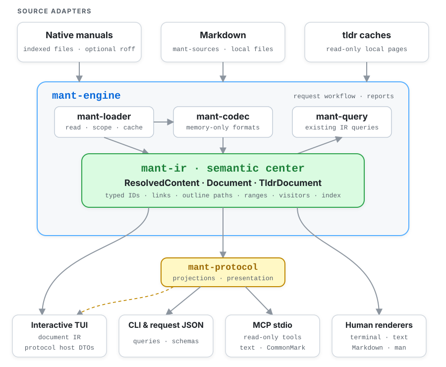

# ManT

[](https://github.com/BryanHeBY/ManT/actions/workflows/ci.yml)
[](https://codecov.io/gh/BryanHeBY/ManT)
[](https://scorecard.dev/viewer/?uri=github.com/BryanHeBY/ManT)
[](https://crates.io/crates/mant)
[](LICENSE)

ManT is a local-first documentation reader and query engine. It turns native
man/mdoc pages and Markdown libraries into one navigable catalog for people,
scripts, and agents.

One native `mant` executable provides a full-screen TUI, deterministic
Markdown/text/JSON output, generated schemas, and a read-only MCP server. Every
interface consumes the same typed document model. Bundled libmandoc gives
Linux with glibc, macOS, and Windows the same manual-page parser without
requiring a system `man` or `mandoc` executable at runtime.


## Install

Install or update the latest release.

**Unix (Linux with glibc, or macOS)**

```sh
curl --proto '=https' --tlsv1.2 -LsSf https://raw.githubusercontent.com/BryanHeBY/ManT/main/scripts/install.sh | sh
```

**Windows (PowerShell)**

```powershell
irm https://raw.githubusercontent.com/BryanHeBY/ManT/main/scripts/install.ps1 | iex
```

All options, uninstallation, and alternative methods are in the
[installation guide](docs/installation.md).

**Agent prompt**

```text
Read https://raw.githubusercontent.com/BryanHeBY/ManT/main/docs/installation.md
and install or update the latest ManT release for this system. Use its
recommended user-scoped method, verify the installation, and report any PATH
change still needed.
```

## One binary, one model, three interfaces

| Interface | Entry point | Designed for |
| --- | --- | --- |
| Interactive TUI | `mant NAME` in a terminal, or `--ui` | Hierarchical reading, document discovery, typed links, history, search, mouse input, and tldr quick references |
| Structured CLI | Projection options, `--format`, or redirection | Outlines, excerpts, semantic explanations, location-aware search, and stable Markdown/text/JSON |
| Read-only MCP | `mant --mcp` | Local discovery and focused document retrieval for agents over stdio |

A complete query automatically opens the reader only when both standard input
and output are terminals. Redirection remains useful and predictable:

```sh
mant git > git.md
mant git | less
```

Use `--ui` to require the reader or `--format markdown` to require output,
independent of terminal detection.

## Why ManT

- **Navigate a documentation library, not just one page.** A single catalog
  covers personal Markdown, installed sources, and native manual sections;
  typed links and bounded back/forward history connect them.
- **Address structure directly.** Sections and a nested semantic index of
  commands, parameters, configuration keys, variables, and values are nodes,
  so `--exclude` can be retrieved
  without searching or copying the complete page.
- **Get the same interpretation everywhere.** The TUI, CLI renderers, search,
  generated schemas, and MCP tools consume one normalized Rust document model.
- **Keep automation predictable.** Outlines and excerpts use explicit selectors;
  search results include reusable nodes and generated-Markdown coordinates.
- **Stay local-first.** Ordinary reading and querying need no network service,
  and the bundled parser avoids a runtime dependency on host manual tools.
- **Treat Markdown as documentation, not a second-class fallback.** It receives
  the same hierarchy, links, semantic entries, search, output, and agent access
  as native manuals.

## Interactive reader

```sh
mant git
mant --input README.md
mant tar --ui
```

The Outline sidebar mirrors nested document sections and reveals semantic
entry groups and their nested commands, parameters, keys, variables, and
values on demand. Compact group rows show their direct count; selecting one
reveals its direct, nested, and authored-form totals. Entry rows use semantic
aliases by default; the selected row shows its complete authored form, and
**View → Full Outline Labels** wraps all visible labels when that detail is
useful. Selecting a node places its target at the top of the content pane;
after scrolling settles, the outline follows the first visible document node.

- `j` / `k` or arrow keys move through visible nodes.
- `h` / `l` collapse and expand branches.
- `d` / `u` or page keys scroll the document.
- `Ctrl+O` opens a live finder for registered Markdown and native manuals.
- The upper-right tab strip keeps successfully opened documents in first-open
  order; click a tab to return to its last selected node.
- `Alt+Left` / `Alt+Right` move backward and forward through document jumps.
- `Ctrl+F` or `/` opens confirmed full-page search.
- `n` and `Shift+N` select the next and previous matches.
- Mouse drag selects and immediately copies rendered text as plain text; a
  short confirmation appears after success. `y` or `Ctrl+Shift+C` copies the
  current selection again, as does right-clicking inside the document.
  `Shift+click` or `Shift+drag` extends it, and `Escape` clears it. Holding a
  drag at the top or bottom edge scrolls the document continuously.
- `F10` opens the menu, `?` opens help, and `q` quits.

The mouse can select and fold outline nodes, follow underlined in-page,
cross-document, and web/email links, scroll both panes, drag scrollbars, and
resize the Outline sidebar. Markdown links stay inside their registered source; man
and mdoc references select an exact manual section.
The Edit menu can copy a complete selected Outline node as deterministic text
or structurally complete Markdown; arbitrary visual selections deliberately
remain plain text so wrapping cannot produce a truncated Markdown fragment.
Presentation-only tldr panel borders are never included in visual copies.
Local sessions use the native clipboard and fall back to OSC 52; WSL, SSH,
and VS Code remote sessions prefer OSC 52 so a compatible outer terminal or
multiplexer can complete the copy. OSC 52 is write-only, so a terminal that
disables it can ignore the request without reporting failure to ManT.

Human-facing help, diagnostics, and tldr output use terminal-aware
colour. `--color auto|always|never` controls the shared policy; automatic mode
honours terminal capabilities, `NO_COLOR`, and `TERM=dumb`. Structured formats
and redirected automatic output never gain presentation escape sequences.
Terminal-bound Markdown additionally masks control characters in dynamic
document identities; redirected Markdown preserves the underlying data exactly.

## Structured discovery and queries

Discover installed Markdown and native manuals without opening each document:

```sh
mant --list
mant --find process
mant --find '^git' --regex --kind manual --format json
```

`--list` exposes one tree rooted at `documents/`, `sources/<source>/`, and
`manual/<section>/`. `--find` emits stable tab-separated canonical paths by
default, making it suitable for filtering and shell pipelines. Literal
discovery ranks exact paths or leaf names first, then component suffixes,
prefixes, and other substring matches; stable path order breaks ties. A query
containing `/` also matches the complete canonical path.

When both standard streams are terminals, text from `--list` and `--find`
opens in a built-in less-like pager only if it exceeds the terminal height.
Use the mouse or the usual less navigation and `/` search bindings;
`--no-pager` forces direct text. Redirected output and `--format json` always
remain plain, deterministic standard output.

Start with an outline and retrieve only the section or option that matters:

```sh
mant gcc --outline
mant ssh --outline --outline-entries all --outline-root=-L
mant git --tldr
mant gcc --node 4.2 --format markdown
mant tar --node acls --format json
mant tar --explain=--exclude
```

Heading paths are one-based. Path `0` and selector `tldr` are reserved for an
available quick reference. `--tldr` selects that node across embedded Markdown
and cached tldr candidates, and permits a quick reference even when no full
document exists. On a color terminal, tldr and text projections such as
outline, node, explanation, and search use semantic styles; pipes, `NO_COLOR`,
and `TERM=dumb` receive plain text.
The default outline emits section topology plus compact semantic coverage.
Use `--outline-entries none|summary|all|KINDS` to control entry expansion and
`--outline-root` to focus one section or semantic entry.
`--color always|never` overrides detection, while an explicit `--format`
continues to select Markdown, text, or JSON.

Search returns a complete outline trail to the nearest reusable node together
with exact generated-Markdown coordinates. Text output presents the same
ancestor chain used by `--explain`:

```sh
mant tar --search=--acls --context 1
mant gcc --search 'worktree|branch' --regex --case smart
mant git --search worktree --follow-links
mant --document git --document git-lfs --explain=--work-tree
```

`--document` is repeatable and defines an ordered set of initial registered documents. `--follow-links` expands that set breadth-first through typed manual and same-source Markdown links; `--max-depth` and `--max-documents` bound the traversal. Search pagination is global across the stable document order, while explanations remain grouped by exact document address. Cycles and duplicate paths query a document once, missing links remain visible in JSON, and the typed frontier distinguishes links excluded by depth from links excluded by the document budget.

With `--ui`, the first initial document opens normally and confirmed text search spans the resolved set. Selecting a match in another document uses the existing back/forward history. The document finder remains global rather than being restricted to the query set.

Partial document queries default to text; Markdown and JSON remain explicit
alternatives. Full output supports Markdown, text, and JSON. Native roff manuals
additionally support `--format man`, which emits manual-only plain text without
tldr content:

```sh
mant git --format markdown
mant --input README.md --format text
mant git --format json --compact
```

Discover machine contracts from the installed binary rather than copying
request shapes from documentation:

```sh
mant --doctor
mant --doctor --format json --compact
mant --schema request
mant --schema all --compact
mant --protocol-version
mant --version
```

`mant --doctor` performs an offline, read-only check of the effective data
paths, registered documents, installed sources, bundled libmandoc, native
manual index, optional Git requirement, and tldr caches. It suggests the
existing explicit maintenance commands without running them. Warnings keep a
successful status; a broken promised capability returns status `1`.

The [structured protocol and Schema reference](docs/manuals/mant-protocol.md)
documents every versioned request and response projection, coordinate rule,
and compact MCP tool. The separate [IR reference](docs/manuals/mant-ir.md)
describes the richer in-process model from which those structured and textual
presentations are projected.

## Build a local documentation library

`mant --list` presents one logical tree regardless of where a document came
from:

```text
documents/                  personal Markdown
sources/<source>/           installed Markdown collections
manual/<section>/           native man and mdoc pages
```

Exact catalog paths are unambiguous. Short selectors use root documents first;
configured sources then sort around native manuals at priority `0`. Positive
sources win, manuals win a zero tie, and negative sources act as fallbacks.
Unique component suffixes make a deep path such as `languages/en/tool`
convenient without hiding collisions.

### Native manuals

ManT indexes raw, gzip, and zstd pages from traditional `man<section>/`
directories and flat roots containing files such as `widget.1`. Project-local
collections can use `MANT_MANPATH` as a complete override:

```sh
mkdir -p ./project-man/man1
cp ./widget.1 ./project-man/man1/widget.1
MANT_MANPATH="$PWD/project-man" mant widget --manual
```

The same index works on Linux with glibc, macOS, and Windows. On Unix it reads
the host's man-path configuration (man-db, mandoc, or macOS `man.conf`) before
using conservative fallbacks; macOS also follows its active Xcode or Command
Line Tools tree. Windows can use `%APPDATA%\ManT\man.conf` with `manpath
DIRECTORY` lines. Logical queries
accept `mant 1 git`, `mant 'git(1)'`, `mant git --man-section 1`, and the
canonical path `mant manual/1/git`. A dotted selector such as `git.1` remains
an exact logical document name; ManT never guesses whether its suffix is a
manual section. Manual aliases and parser I/O remain bounded to their indexed
collection; the complete lookup and `.so` policy is documented in the
[mant manual](docs/manuals/mant.md).

### Markdown collections

Personal `.md` and `.markdown` files below ManT's `documents/` directory keep
their extension-free relative hierarchy. Configured Git repositories and
direct archive URLs are installed in the sibling managed `sources/` directory,
without mixing their files into the personal tree:

```toml
[team]
repo = "https://github.com/example/cli-docs.git"
branch = "main"
path = "manuals"
priority = 10
```

Run `mant --update-docs` to install or update configured sources and
`mant --prune-docs --dry-run` before explicitly removing orphaned source data.
Windows selectors try an exact documented executable name before following
`PATHEXT`, so packages can retain canonical names such as `tool.exe.md` while
`mant tool` remains convenient. The [document-source guide](docs/sources.md)
defines platform paths, archive configuration, selection, precedence, and
transactional update behavior.

Personal `documents/` may use leaf-file symlinks to regular files, including
targets outside that tree; broken links and directory symlinks are ignored.
Installed source caches never follow links, and source acquisition rejects
selected Git or archive links so packages remain portable across platforms.

Markdown headings, prose, code, links, lists, tables, and selected semantic
definition lists enter the same model as native manuals. Unsupported syntax
remains visible with a diagnostic instead of being silently discarded. The
bundled [mant-markdown(7)](docs/manuals/mant-markdown.md) and
[mant-roff(7)](docs/manuals/mant-roff.md) manuals define the exact input
contracts; every bundled manual is also a self-hosted ManT document.

### One-off input and quick references

Physical files are deliberately separate from logical catalog selectors:

```sh
mant --input README.md
mant --input /usr/share/man/man1/git.1.gz --outline
cat guide.md | mant --input - --input-format markdown
cat widget.1 | mant --input - --input-format roff
```

When compatible local tldr data exists, a combined query that selects a native
section `1` or `8` family page places its quick reference before the full
document as reserved node `0`. This includes unqualified queries and exact
section selectors such as `mant 1 tar`. Other native categories do not acquire
an unrelated command quick reference. `--manual` deliberately excludes quick
references. `mant git --tldr` selects only the quick reference; an unambiguous
section qualifier such as `mant 1 tar --tldr` is accepted for command families
`1` and `8`, but it does not become part of the tldr topic. For `--tldr`, a Markdown
candidate participates only when it actually embeds a quick reference: personal
documents win, positive source priorities precede the cached tldr baseline at
`0`, and zero or negative sources follow it. `--source NAME` restricts this
lookup to the selected Markdown source. A cached tldr entry does not make a
missing ordinary document query succeed: ManT reports the failed lookup and
suggests the explicit `mant NAME --tldr` command instead. ManT reads
installed-client caches or its private cache, which `mant --update-tldr` can
update. Markdown authors may also embed a document-owned quick reference using
the format described in the [mant manual](docs/manuals/mant.md).

## MCP

Run the same executable as a read-only MCP server:

```sh
mant --mcp
```

Configure the client command as `mant` with arguments `["--mcp"]`. Five
read-only tools—`mant_find`, `mant_outline`, `mant_read`, `mant_explain`, and
`mant_search`—return bounded plain text or CommonMark instead of the complete
document AST. Start with `mant_find`; its canonical document IDs remove
ambiguity from later calls. Each call reads the files currently visible in
`documents/`, configured installed sources, and native manual paths. MCP has no
update, network, or mutation tool and does not promise a session snapshot
across calls. Detailed lowering diagnostics remain available through ordinary
CLI JSON queries.

Every successful result starts with a `mant-page` header that reports its
Unicode-scalar character interval and total size. Clients select a bounded
`maxChars` budget and can resume with `startChar`; paging reruns the base query
against current local state and retains no cursor. `maxResults` and
`maxMatches` independently bound find and search materialization before
character paging; omitted rows or matches require a larger semantic limit or a
narrower query.

`mant_explain` and `mant_search` accept several initial document IDs and can
optionally follow typed links as a bounded breadth-first scope. Native CLI
queries and interactive cross-document search use the same scope model.

## Architecture



`mant-ir` is the semantic center nested inside the `mant-engine` execution
layer. Interactive use passes its in-memory `ResolvedContent` directly to
`mant-ui`, and human renderers operate on the same model. Structured host and
process interactions share the `mant-protocol` contract layer. Catalog
callbacks, CLI JSON, request JSON, and MCP therefore use the same logical
identities and projections, while each boundary chooses its appropriate
representation: versioned JSON for processes and compact text for MCP. Git and
archive updates are an optional native CLI capability
layered on `mant-sources`, not part of document reads or MCP.

## Documentation

- [Installation methods and platform requirements](docs/installation.md)
- [mant(1) command manual](docs/manuals/mant.md)
- [Document source configuration and updates](docs/sources.md)
- [mant-protocol(5) structured integration contract](docs/manuals/mant-protocol.md)
- [mant-ir(7) normalized document model](docs/manuals/mant-ir.md)
- [mant-markdown(7) supported Markdown](docs/manuals/mant-markdown.md)
- [mant-roff(7) native manual compatibility](docs/manuals/mant-roff.md)
- [Native engine and crate boundaries](docs/architecture/native-engine.md)
- [Development guide and repository map](docs/development.md)
- [Maintainer release procedure](docs/releasing.md)
- [Crate compatibility changelog](CHANGELOG.md)
- [Release history and upgrade notes](https://github.com/BryanHeBY/ManT/releases)

## License

ManT-authored work is licensed under the [Apache License 2.0](LICENSE).
Rust dependencies, bundled parser sources, cached tldr-pages content,
real-world test fixtures, and screenshot fonts retain their upstream terms;
upstream tldr pages are CC BY 4.0 and are attributed at render time. See the
[third-party notice map](THIRD_PARTY_NOTICES.md). Native releases include a
CycloneDX SBOM and signed GitHub provenance/SBOM attestations.
Please report vulnerabilities through the private process in the
[security policy](SECURITY.md).
